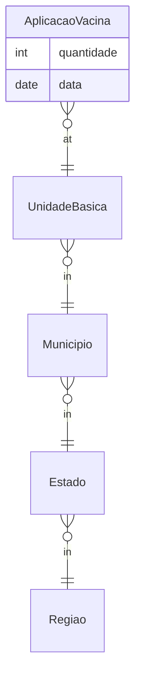

# Vaccine Backend — Dimensional Data Warehouse

> A vaccination analytics API backed by a **star schema** (dimension + fact tables), built with
> **Spring Boot**, with SQL DDL and Python-generated seed data.


## What this demonstrates

- **Dimensional modeling (Kimball)** — an explicit **star schema**: a `AplicacaoVacina`
  (vaccine-application) **fact** surrounded by geographic/organizational **dimensions**
  (Estado, Município, Região, Unidade Básica).
- **Data warehouse fundamentals** — fact/dimension separation, conformed geographic hierarchy,
  and SQL DDL (`init_table.sql`).
- **Seed / synthetic data generation** — Python generators (`generate_aplicacao_vacina.py`,
  `mock_data.py`) plus CSV dimension seeds.
- **Analytics API** — Spring Boot controllers/services exposing fact and dimension queries.

## Star schema



`AplicacaoVacina` = fact (measures); `Estado / Municipio / Regiao / UnidadeBasica` = dimensions.

## Tech stack

Java · Spring Boot · Maven · SQL · Python (data generation) · CSV seeds.

## Quickstart

```bash
# 1. create schema + load dimensions
psql ... -f src/python/data/init_table.sql
# 2. (optional) generate fact data
python src/python/generate_aplicacao_vacina.py
# 3. run the API
./mvnw spring-boot:run
```

## Project structure

```
src/main/java/com/undb/vaccine/backend/
  api/dimension/   # Estado, Municipio, Regiao, UnidadeBasica (+ repositories)
  api/fact/        # AplicacaoVacina (+ repository, service, controller)
src/python/
  data/            # estado.csv, municipio.csv, regiao.csv, unidade_basica.csv, init_table.sql
  generate_aplicacao_vacina.py  mock_data.py
```

## License

MIT (add a `LICENSE` file).
